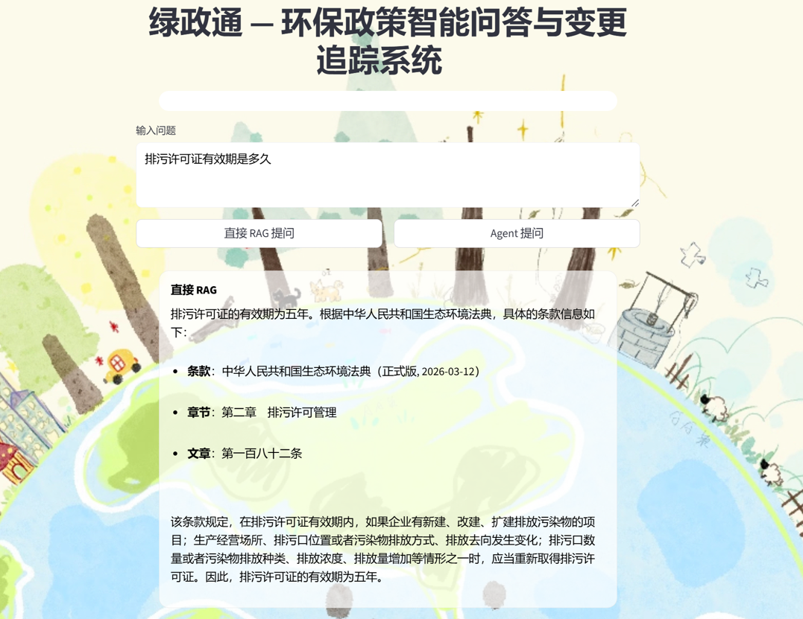
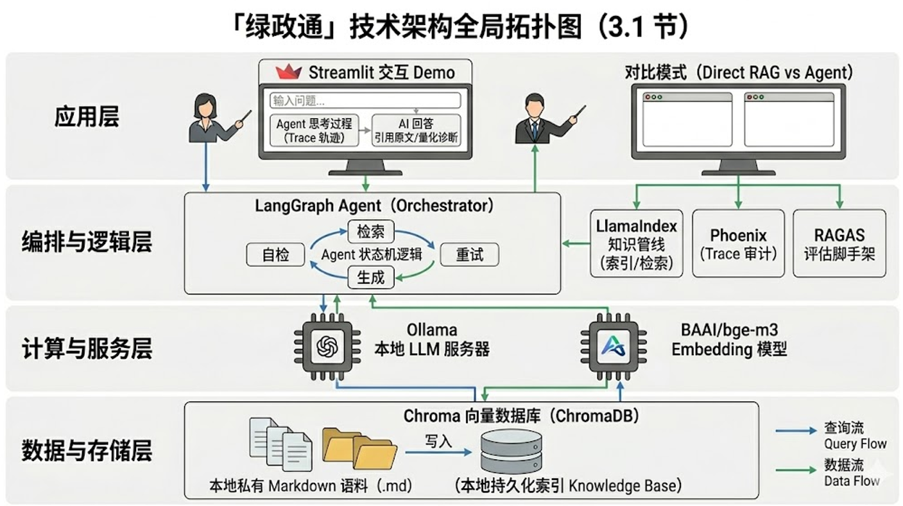
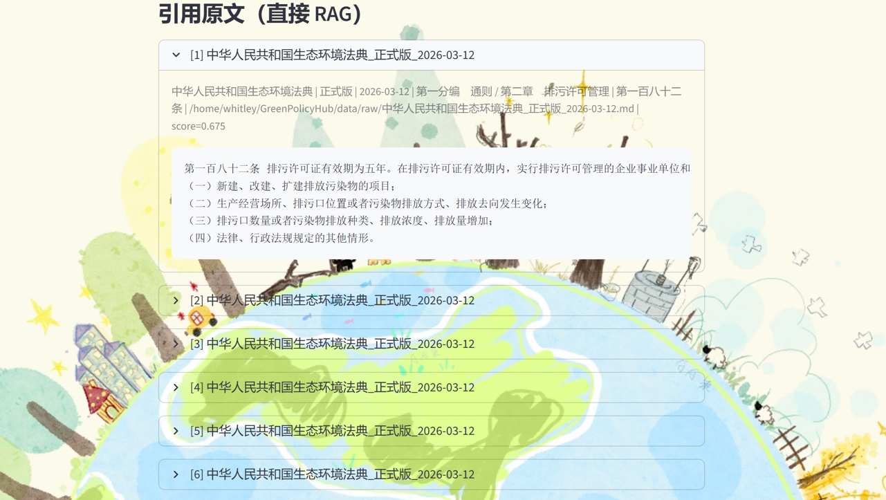

Project Source Code: 🚀 GitHub Repository: https://github.com/djdj-student/greenpolicy_cited_rag

## Update Log

- 2026-04-01: Refined wording in key sections and synchronized the post for repository publishing.

## English Version

## Abstract

Green policy and dual-carbon knowledge evolves at high velocity, originates from heterogeneous authorities, and is encoded in clause-dense legal language. In this context, locating a document is not equivalent to resolving a question, and producing an answer is not equivalent to producing an auditable conclusion. GreenPolicyHub is designed to transform fragmented policy evidence across portals, announcements, PDFs, and regulatory repositories into a searchable, citable, and verifiable knowledge infrastructure. Retrieval-Augmented Generation (RAG) provides the engineering bridge between policy retrieval and policy interpretation.

This article starts from real product pain points and presents a deployable blueprint for GreenPolicyHub: data ingestion -> structure-aware chunking -> hybrid indexing and retrieval -> citation-grounded generation -> evaluation and feedback loop. It further discusses recurrent failure modes in policy intelligence systems, including temporal version drift, citation mismatch, region-scope confusion, and hallucinated inference.



## 1. Why Green Policy Is a Strong Fit for RAG

Unlike encyclopedia-style knowledge, policy documents exhibit four structural characteristics:

- Strong citation constraints: article numbers, annexes, issuing authority, and publication time all carry legal force.
- High temporal volatility: the same topic can move from draft to consultation, promulgation, and repeal in short cycles.
- High semantic density: a single paragraph may simultaneously encode definitions, scope boundaries, exemptions, and computational rules.
- Query-to-title mismatch: users rarely ask for a document name; they ask which clause governs their concrete scenario.

Therefore, naively injecting all documents into an LLM is both costly and weakly controllable. RAG is suitable because it:

- Retrieves the most relevant policy fragments before generation.
- Constrains conclusions to explicit evidence, enabling traceability, auditability, and counterfactual review.

## 2. MVP Definition of GreenPolicyHub

One-sentence definition:

> A policy retrieval and interpretation platform for green policy: users ask questions, and the system returns answers, cited clauses, source links, and uncertainty disclosures.

At the MVP stage, system output can be reduced to four indispensable elements:

1) Direct answer: a natural-language conclusion with explicit applicability conditions.

2) Evidence citation: quoted policy fragments with chapter, page, or paragraph metadata.

3) Clickable sources: links to original pages or downloadable files.

4) Boundary statement: when evidence is insufficient, explicitly state unknown or not specified instead of fabricating content.

## 3. System Architecture: From Documents to Auditable Answers

The full engineering workflow can be decomposed into five layers.



### 3.1 Data Layer: Collection and Normalization

Policy corpora typically appear as HTML and PDF, with a smaller tail of Word files and scanned images. In production, ingestion should be designed as a replayable pipeline:

- Crawl: incrementally collect from sitemaps or listing pages using publish and update timestamps.
- Parse: extract title, issuer, document number, publication date, effective and repeal dates, body text, and annexes.
- Deduplicate and version: maintain canonical versions plus mirrored sources for near-duplicate documents.

Suggested JSON schema:

```json
{
	"doc_id": "...",
	"title": "...",
	"issuer": "...",
	"region": "...",
	"publish_date": "2026-03-01",
	"effective_date": "2026-04-01",
	"status": "effective",
	"source_url": "https://...",
	"content": "full text...",
	"attachments": [
		{"name": "Annex 1", "url": "https://..."}
	]
}
```

### 3.2 Knowledge Layer: Structured Chunking

In policy RAG, chunking quality often determines answer quality. Naive fixed-length chunking tends to cause:

- Numbering loss (e.g., Article 12 detached from its substantive text).
- Decoupling of scope and exemption conditions, which can invert legal interpretation.

A safer strategy is structure-first chunking:

- Split by chapter, article, clause, and item whenever possible.
- Preserve the heading-tree path as metadata (e.g., Chapter 3 / Article 12 / Item 2).
- Apply secondary sentence-level splitting only when structural chunks exceed length constraints.

Recommended metadata per chunk:

- doc_id, title, issuer, region
- section_path (chapter/section/article)
- offset (page or paragraph index)
- publish_date, effective_date, status

### 3.3 Index Layer: Vector + Keyword Hybrid Retrieval

Green policy includes many hard lexical anchors, such as document IDs, program names, metric definitions, and industry catalogs. Pure vector retrieval may miss exact entities, while pure keyword retrieval may fail on semantic paraphrases.

Hence, hybrid retrieval is recommended:

- Keyword retrieval (BM25/inverted index) for precise term matching.
- Vector retrieval for semantic recall.
- Reranking (cross-encoder or LLM rerank) for final precision.

### 3.4 Generation Layer: Controlled Answering with Evidence Binding

The central generation principle is evidence-first answering. A practical response template includes:

- Conclusion: a one-sentence determination whenever possible.
- Applicability conditions: scope, target entity, timeline, and region.
- Evidence citations: supporting fragments with source metadata.
- Uncertainty statement: explicit missing information required for a valid judgment.

Anti-hallucination system prompt example:

```text
You are a green policy assistant. You must answer only based on retrieved policy snippets.
If no explicit support exists in the snippets, answer: "No supporting basis found in the provided policy snippets" and request necessary additional information.
Every conclusion must cite at least one snippet and include source metadata (title/section/publish date/link).
```



### 3.5 Feedback Layer: Evaluation, Correction, and Traceability

GreenPolicyHub should optimize for accountable answers rather than merely plausible ones:

- Citation accuracy: does each citation actually support the conclusion?
- Coverage adequacy: are key exemptions or scope constraints missing?
- Temporal correctness: are obsolete or draft documents being treated as current policy?

A dual-loop feedback design is advisable:

- User-side feedback: one-click labels such as irrelevant citation, unsupported conclusion, or need more information.
- System-side feedback: offline benchmark set and regression testing after each index/model update.

## 4. Common Pitfalls in Green Policy Scenarios and How to Avoid Them

### 4.1 Version and Time Validity

Questions such as current subsidy eligibility vary significantly across policy versions and years.

Engineering practices:

- Filter retrieval with effective_date and status.
- Force generation to output version/date statement.
- Distinguish draft for comments, final regulation, and local implementation details.

### 4.2 Regional Scope Differences

Green policy is deeply localized in both wording and implementation thresholds.

Engineering practices:

- Make region a top-level metadata filter, with same-region priority by default.
- If user region is missing, ask for clarification or provide region-by-region comparison instead of guessing.

### 4.3 Citation Drift and Misinterpretation

The most critical failure mode is citation drift: citing a relevant paragraph while applying inapplicable conditions.

Engineering practices:

- Keep full conditional sentences and numbering in chunks.
- Show sufficiently long citation snippets to avoid context truncation.
- Add citation-consistency checks to verify whether each citation supports each conclusion.

## 5. A Practical End-to-End Flow

Example user question:

> Our company plans an energy-efficiency retrofit project in a specific region. What are the basic requirements for applying for green subsidies or support?

Pipeline:

1) Query parsing: extract region, industry, project type, and time window; mark missing fields.

2) Hybrid retrieval: keyword recall plus vector recall.

3) Rerank: compress top candidates to 6-10 high-confidence evidence chunks.

4) Controlled generation: output conclusion, conditions, citations, and uncertainty.

5) Audit logging: record citations, temporal filters, and model settings for reproducibility.

## 6. Roadmap: Toward a Policy Operating System

After MVP, the most valuable upgrades are usually:

- Policy change detection: automatic diff and impact summary on updates.
- Timeline view: policy evolution by region/topic.
- Structured extraction: convert eligibility criteria, applicant type, required materials, deadlines, and authority into tables.
- Configurable compliance templates: self-checklists and gap alerts for enterprise users.

## Closing

The core value of GreenPolicyHub is not to make an LLM more conversational. It is to recast policy intelligence as an auditable, reviewable, and continuously improvable engineering system. In this system, retrieval is the gateway, citation is the baseline, and evaluation is the moat.

---

## 中文版

摘要
绿色政策与双碳信息呈现出高频更新、多源发布与高条款密度并存的特征。在这一语境下，“能检索到文件”并不等价于“能回答具体问题”，而“能生成答案”也不等价于“答案可追溯、可审计”。GreenPolicyHub 的核心目标，是将分散于门户网站、公告系统、PDF 文件与法规数据库中的政策文本，重组为一个可检索、可引用、可复核的知识基础设施。RAG（Retrieval-Augmented Generation）为“政策检索”与“政策解读”之间搭建了可工程化的桥梁。

本文从真实产品痛点出发，提出一套可落地的 GreenPolicyHub 方案：数据摄取 -> 结构化切分 -> 混合索引与检索 -> 引用约束生成 -> 评测与反馈闭环。同时，重点分析政策问答系统中的典型失效模式，包括版本漂移、引用错配、地区口径混淆与模型幻觉。


1.背景：为什么绿色政策特别适合 RAG

与百科型知识相比，政策文本具有更强的制度结构特征：

- 可引用性强：条款编号、章节结构、附件、发文机关与发布日期都可能影响结论合法性。
- 时效敏感性高：同一议题会在征求意见、正式发布、修订与废止之间快速演化。
- 语义压缩度高：单段文本常同时包含定义、适用边界、豁免条件与计算口径。
- 检索语义错位：用户关心的通常不是文件名，而是“我的场景对应哪一条”。

因此，将全量文档直接输入大模型既昂贵又难控。RAG 的价值在于：

- 先检索后生成，使回答建立在高相关证据片段之上。
- 将结论与证据绑定，让系统天然具备可审计与反事实复核能力。

2.GreenPolicyHub 的最小可行产品定义（MVP）

一句话定义 GreenPolicyHub：

> 一个面向绿色政策的“检索 + 解读”平台：用户输入问题，系统返回结论、引用条款、来源链接与不确定性说明。

在 MVP 阶段，输出能力可压缩为四个必要组件：

1) 直接回答：给出自然语言结论及其适用条件。

2) 引用证据：提供条款片段及章节、页码或段落元数据。

3) 来源可达：支持跳转至原文页面或下载原始文件。

4) 边界声明：证据不足时明确标注“未知/未提及”，而非凭空补全。

3.系统架构：从文档到可审计答案

GreenPolicyHub 的工程链路可分为五层。


3.1 数据层：采集与规范化

政策数据的主流形态是 HTML 与 PDF，辅以少量 Word 与扫描件。实践中建议将采集设计为可重放流水线：

- 抓取：基于站点地图或列表页，按发布日期与更新时间进行增量采集。
- 解析：抽取标题、发文机关、文号、发布日期、生效与废止日期、正文与附件。
- 去重与版本：对多源转载文本建立“主版本 + 镜像来源”的版本关系。

输出建议落在统一 JSON schema（示意）：

```json
{
	"doc_id": "...",
	"title": "...",
	"issuer": "...",
	"region": "...",
	"publish_date": "2026-03-01",
	"effective_date": "2026-04-01",
	"status": "effective",
	"source_url": "https://...",
	"content": "全文...",
	"attachments": [
		{"name": "附件1", "url": "https://..."}
	]
}
```

3.2 知识层：结构化切分（Chunking）

政策 RAG 的上限往往由切分质量决定。若仅按固定字数切分，常见问题包括：

- 条款编号与正文脱节，例如“第十二条”被孤立。
- 适用范围与豁免条件被拆散，导致解释偏差甚至反转。

更稳健的策略是“结构优先”：

- 优先按章节、条、款、项切分。
- 保留标题树路径作为 chunk 元数据（如“第三章/第十二条/第二项”）。
- 当结构块过长时，再进行句级二次切分。

建议每个 chunk 至少携带以下元数据：

- doc_id、title、issuer、region
- section_path（章/节/条）
- offset（页码或段落序号）
- publish_date、effective_date、status

3.3 索引层：向量索引 + 关键词索引（Hybrid）

绿色政策包含大量“硬锚点”术语，如文号、项目名称、指标口径与行业目录。仅靠向量检索容易漏召精确实体，仅靠关键词检索又难覆盖语义等价表达。

因此建议采用 Hybrid Retrieval：

- 关键词检索（BM25/倒排）负责术语精确命中。
- 向量检索负责语义层召回。
- 通过 reranker（交叉编码器或 LLM rerank）完成最终精排。

 3.4 生成层：受控回答与证据绑定

生成阶段的首要原则是“证据先于结论”。一个实用回答模板可包含：

- 结论：在条件充分时给出一句话判断。
- 适用条件：明确对象范围、时间口径与地区边界。
- 引用依据：逐条给出证据片段及来源元数据。
- 不确定性说明：缺信息时明确指出仍需补充的字段。

一个防幻觉 system prompt（示意）：

```text
你是绿色政策助手。只能基于【检索到的政策片段】回答。
如果片段里没有明确依据，请回答："未在提供的政策片段中找到依据"，并提出需要的补充信息。
每个结论都必须引用至少一个片段，并标注来源（标题/章节/发布日期/链接）。
```


 3.5 反馈层：评测、纠错与可追溯

GreenPolicyHub 不应优化“看起来正确”的答案，而应优化“可追责”的答案：

- 引用准确性：引用片段是否真实支撑对应结论。
- 覆盖充分性：是否遗漏关键豁免条件或适用边界。
- 时效正确性：是否将废止文本或征求意见稿误当现行口径。

建议构建双反馈闭环：

- 用户侧反馈：一键标注“引用不相关/结论不成立/需要更多信息”。
- 系统侧反馈：离线评测集与每次模型或索引升级后的回归测试。

4.绿色政策场景的常见陷阱与规避策略

 4.1 版本与时效：同题不同解

“当前补贴条件是什么”这类问题常随年份与版本变化。

工程建议：

- 检索阶段将 effective_date 与 status 设为硬过滤条件。
- 生成阶段强制输出“口径日期/版本说明”。
- 在结论中显式区分征求意见稿、正式稿与地方实施细则。

4.2 地域口径：同名政策异地异义

绿色政策具有强地域性，不同地区往往同名不同标尺。

工程建议：

- 将 region 提升为一级元数据过滤，默认同地区优先。
- 当用户未提供地区信息时，先澄清或输出分地区对比，而非隐式猜测。

 4.3 引用漂移与解释偷换

最危险的错误不是“没引用”，而是“引用了相关段落却套用了错误条件”。

工程建议：

- chunk 内保留完整条件句与编号。
- 引用展示保持足够上下文，避免截断导致语义断裂。
- 增加引用一致性检查，逐条判定“该引用是否支持该结论（是/否/不确定）”。

 5.可落地的端到端流程

以用户问题为例：

> “我们公司在某地区做节能改造项目，申请绿色相关补贴/支持的基本条件有哪些？”

端到端步骤：

1) **Query 解析**：抽取地区、行业、项目类型、时间窗口（缺失就标记为待补充）。

2) **Hybrid 检索**：关键词召回（“节能改造/补贴/支持/申报”）+ 向量召回（语义相近条款）。

3) **Rerank**：把前 50 个候选压缩到前 6-10 个证据片段。

4) **受控生成**：基于证据输出“结论/条件/引用/不确定性”。

5) **审计输出**：把引用、版本、过滤条件与模型配置写入日志，保证可复现。

6.Roadmap：让 GreenPolicyHub 走向“政策操作系统”

如果 MVP 跑通，下一步最有价值的增强通常是：

- **政策变更检测**：同一主题政策更新时自动生成 diff 与影响摘要
- **时间线视图**：按地区/主题把政策演进串起来
- **结构化字段抽取**：把“申报条件/对象/材料/截止日期/主管部门”抽成表
- **可配置的合规模板**：面向企业侧的“自查清单”与“缺口提示”

结语

GreenPolicyHub 的目标从来不是“让模型更会对话”，而是把政策知识组织成一个可追溯、可复核、可迭代的工程系统。若把政策世界比作不断改道的河网，那么检索是航道，引用是航标，评测是防波堤；三者共同决定系统能否在复杂现实中稳定前行。

