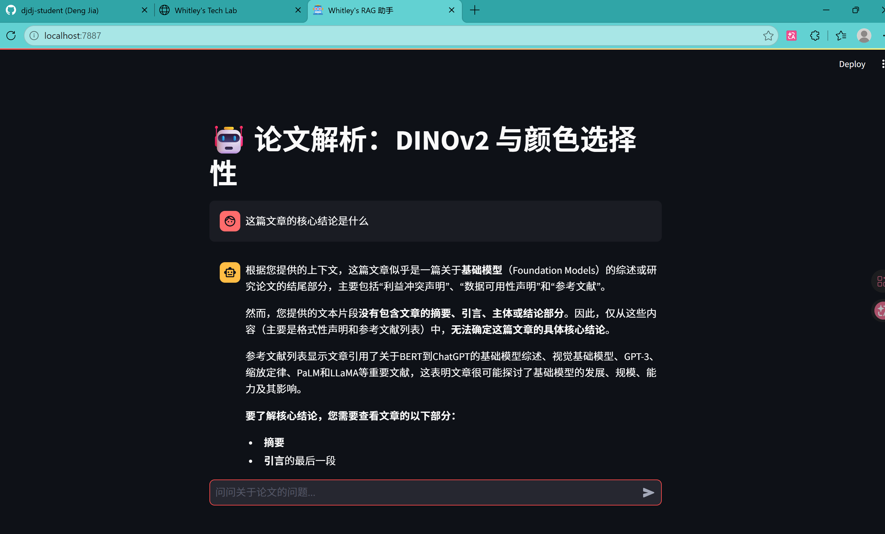
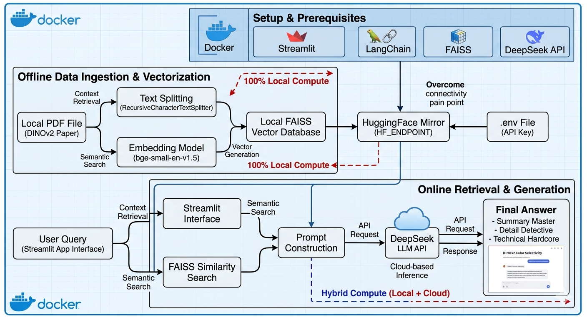
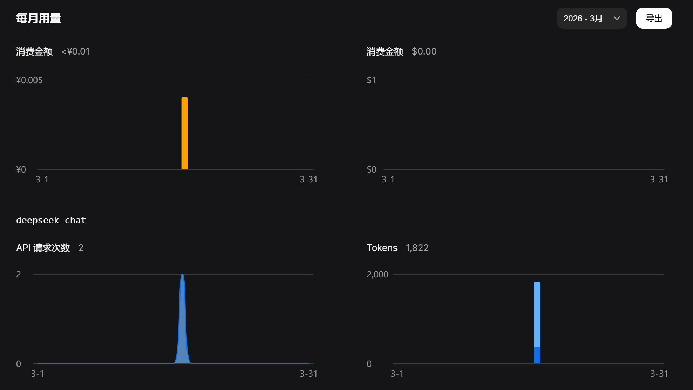
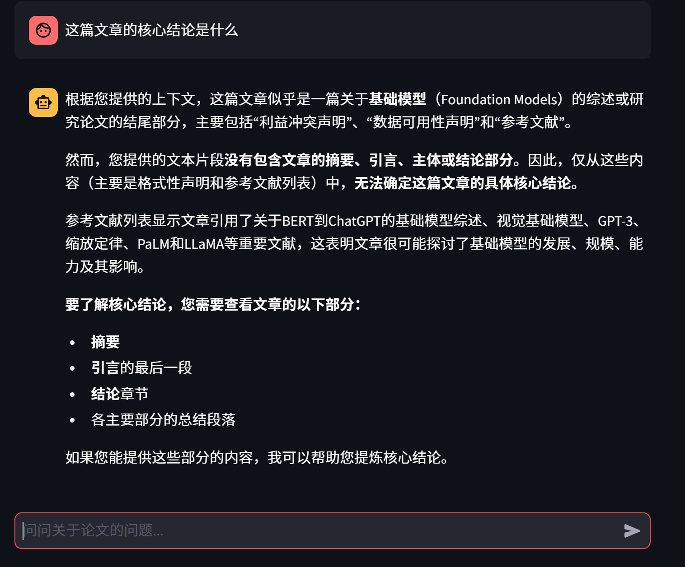
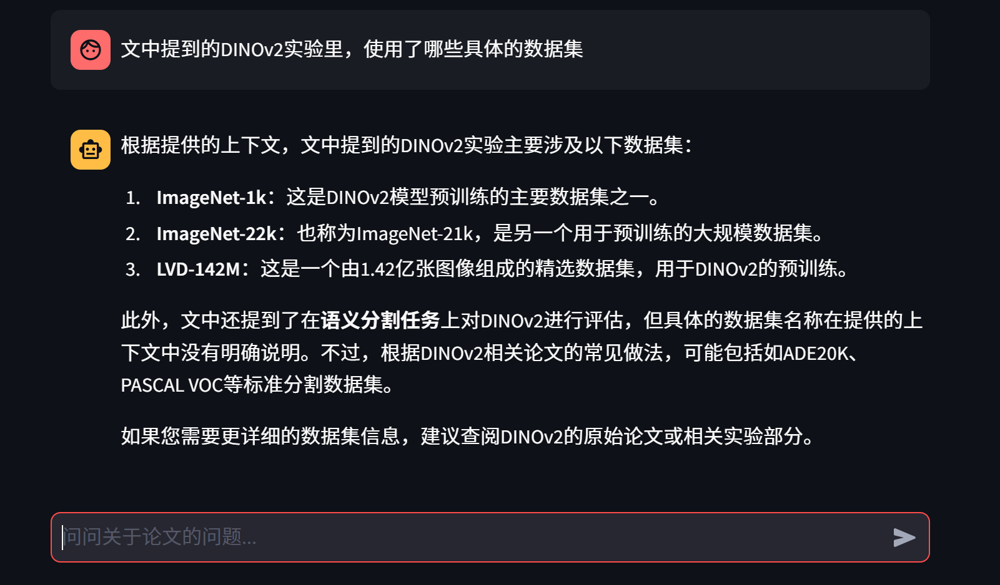
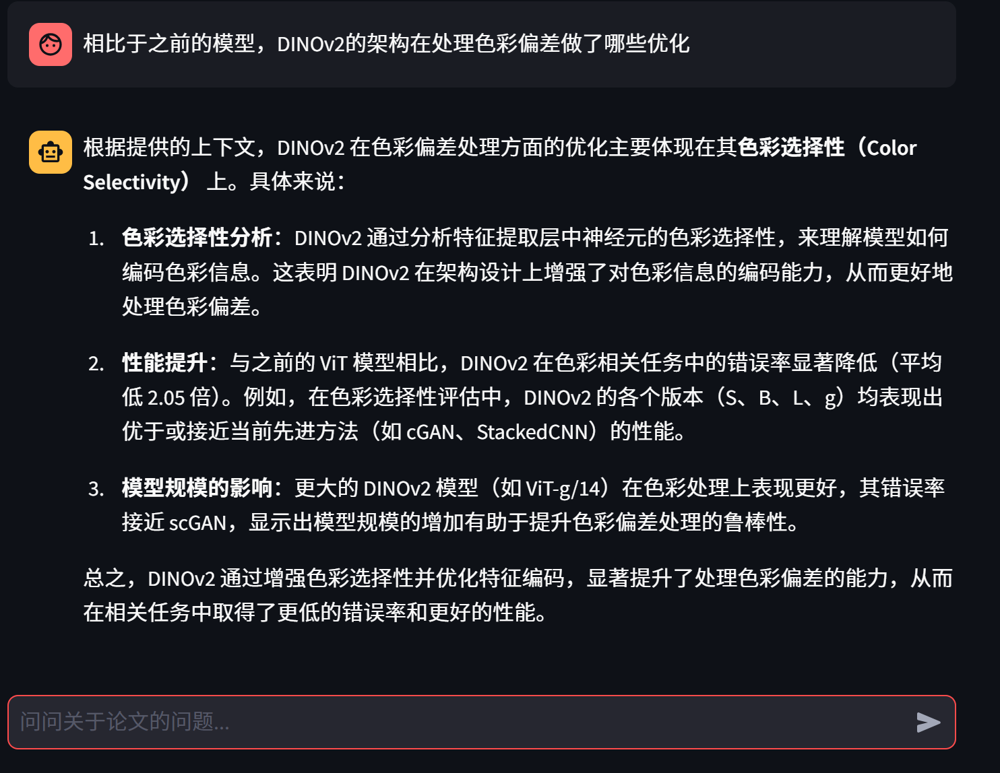

Project Source Code: 🚀 GitHub Repository: AI_RAG_PROJECT

## 1. Background & Environment Setup

### 1.1 Why RAG + PDF Research Papers?
In the AI era, while LLMs are powerful, they still suffer from "hallucinations" when dealing with specific or real-time knowledge—such as the latest scientific papers. **RAG (Retrieval-Augmented Generation)** acts as a dynamic, real-time knowledge base attached to the AI.

The core challenge of this experiment lies in **PDF Parsing**. Research papers often feature double-column layouts and complex formulas, requiring a system that doesn't just "read" text, but truly "understands" the document structure.

### 1.2 Core Architecture: Docker + DeepSeek
To achieve high performance, low cost, and high portability, I chose a lightweight, deployable, and full-stack architecture:

- **DeepSeek-R1**: The foundational LLM for reasoning and generation.
- **LangChain**: Orchestrating the RAG pipeline (Loading → Splitting → Embedding → Retrieval → Generation).
- **Sentence-Transformers**: Local open-source embedding models.
- **FAISS**: A lightweight vector database.
- **Streamlit**: For rapid Web interface development.
- **Docker + Docker Compose**: Containerizing the entire environment.

### 1.3 Containerized Deployment in Action
I developed a streamlined `docker-compose.yml` to drive the system, focusing on **development efficiency** and **security isolation**:

```yaml
services:
  app:
    build: .
    # Port mapping: Access Streamlit via localhost:7887
    ports:
      - "7887:8501" 
    
    # Security: Manage DeepSeek API Key via env file
    env_file:
      - .env
    
    # Efficiency: Mount current directory for "hot-reloading"
    volumes:
      - .:/app
    
    # Interactive mode: For real-time debugging of PDF parsing errors
    stdin_open: true
    tty: true
```

## 2. PDF Parsing & Knowledge Base Construction
This section is the core essence of RAG. The goal: How to make DeepSeek "read" the static text trapped in PDFs?

### 2.1 The "Deep Water" of PDF Parsing
Scientific papers are rarely simple text. Their double-column layouts and complex formatting mean that a "brute-force" text extraction will often scramble the semantic meaning.

### 2.2 Practice: Extracting Content with Python
In this experiment, I used PyMuPDF (fitz). It’s incredibly fast and does a great job of preserving the document's logical structure.
import fitz  # PyMuPDF library

```python
def extract_text_from_pdf(pdf_path):
    # Open the PDF file
    doc = fitz.open(pdf_path)
    full_text = ""
    
    for page in doc:
        # Extract text from the current page
        full_text += page.get_text()
        
    return full_text
```

> Pro Tip: For double-column papers, consider using page.get_text("blocks"). This reads content by physical blocks, preventing the text from left and right columns from getting mixed up.
> 
## 3. LLM Integration: Connecting the DeepSeek Engine
With structured text blocks ready, the next step is building the bridge to DeepSeek-R1. Here, we don't just send a query; we feed the "retrieved PDF snippets" as context to the model.

### 3.1 Why DeepSeek-R1?
DeepSeek’s Chain of Thought (CoT) capability is exceptional for complex academic papers. It identifies logical correlations within experimental data rather than just repeating words.

### 3.2 Implementation Python
Here is the core function running inside the container, utilizing the API Key configured in our .env file:

```python
import os
from openai import OpenAI
from dotenv import load_dotenv

load_dotenv()

client = OpenAI(
    api_key=os.getenv("DEEPSEEK_API_KEY"), 
    base_url="[https://api.deepseek.com](https://api.deepseek.com)"
)

def ask_deepseek(context, query):
    # Constructing the Prompt: Forcing the model to answer based on Context
    prompt = f"Answer the question based on the following PDF content:\n{context}\n\nQuestion: {query}"
    
    response = client.chat.completions.create(
        model="deepseek-chat",
        messages=[
            {"role": "system", "content": "You are a professional academic assistant. Provide accurate answers based on the provided document."},
            {"role": "user", "content": prompt},
        ],
        stream=False
    )
    return response.choices[0].message.content
```

### 3.3 Prompt Engineering: Avoiding Hallucinations
A common issue in RAG is the AI "making things up" beyond the document. To prevent this, I added a strict constraint to the System Prompt.
Core Strategy: "If the information is not present in the document, simply answer 'Sorry, this content is not mentioned in the document.' Strictly avoid hallucinations."

## 4. Hard-earned Lessons: Networking & Versioning Issues
The biggest challenge wasn't the algorithm, but the "war" against networking issues and dependency conflicts. Here are the essential fixes:

### 4.1 Pip Timeouts & Mirror Acceleration
The Pain Point: pip install in Docker often triggers ReadTimeoutError due to network instability, causing the build to fail.
The Fix: Use a local mirror (like Tsinghua) and increase timeout settings in your Dockerfile:
Accelerate build with a mirror and disable cache for stability

```bash
RUN pip install --no-cache-dir \
    -i [https://pypi.tuna.tsinghua.edu.cn/simple](https://pypi.tuna.tsinghua.edu.cn/simple) \
    -r requirements.txt
```

### 4.2 LangChain "Version Hell"
The Pain Point: LangChain evolves rapidly, and APIs are often not backward compatible. A simple pip install langchain can break your code with ImportError.
The Fix: Lock your versions strictly in requirements.txt. Here is my "Golden Combination":

```text
langchain==0.1.12
langchain-community==0.0.28
langchain-openai==0.0.8
python-dotenv==1.0.1
PyMuPDF==1.23.26
```

### 4.3 Missing System Dependencies
The Pain Point: Libraries like fitz won't run on lightweight images (like python:3.9-slim) because they lack underlying GUI/graphics libraries.
The Fix: Install system-level dependencies before the pip install step:

```bash
RUN apt-get update && apt-get install -y \
    libgl1-mesa-glx \
    && rm -rf /var/lib/apt/lists/*
```

## 5. The "Last Mile" Strategy: Final Deployment & Debugging
Even with a perfect Dockerfile, the real world (and school networks) will throw curveballs. Here is how I pushed through the final 1% to get the RAG assistant live.

### 5.1 HuggingFace Connectivity & Mirroring
The Pain Point: In certain network environments (like campus Wi-Fi), connecting to huggingface.co to download embedding models (e.g., BAAI/bge-small-en-v1.5) is notoriously unstable, leading to OSError: Max retries exceeded.
The Fix: Use a dedicated mirror. By setting the environment variable in main.py, the download speed jumps from "Time Out" to "Instant Success":

```python
import os
os.environ["HF_ENDPOINT"] = "https://hf-mirror.com"

#Now load my embeddings as usual
from langchain_community.embeddings import HuggingFaceBgeEmbeddings
```

### 5.2 The "Transformers" Hidden Bug
The Pain Point: During the final run, I encountered a bizarre NameError: name 'nn' is not defined. This was actually a regression bug in the latest transformers library.
The Fix: Don't trust the latest version blindly. Pin it to a stable release that is known to work with PyTorch 2.1:

```text
# Update my requirements.txt
transformers==4.40.0
sentence-transformers==2.7.0
```

## 6. Project Retrospective: The Results
After hours of intense debugging, seeing the "You can now view your Streamlit app" message in the terminal was the ultimate reward.
🚀 How It Works Under the Hood
This project isn't just about "chatting with a PDF." It implements a complete RAG Lifecycle:
 * Ingestion: Parses the DINOv2 paper and splits it into 1000-character chunks.
 * Vectorization: Uses a local BGE Embedding model (running on your own CPU/RAM) to convert text to math.
 * Retrieval: Uses FAISS to find the top 3 most relevant segments of the paper for every user question.
 * Generation: Sends the context + question to the DeepSeek API to generate a precise, grounded answer.

📊 Live Demo
Here is the final assistant in action, successfully analyzing the "Color Selectivity" of DINOv2:


> Caption: My RAG assistant running inside a Docker container, providing insights directly from the DINOv2 research paper.
> 

## 7. Final Thoughts: Why This Matters
As an AI major, this project taught me that 80% of AI engineering is actually "Plumbing"—managing environments, fixing dependencies, and ensuring robust deployment. The algorithm is the brain, but Docker and LangChain are the skeletal system that makes it functional.
Next Steps:
 * [ ] Integrate a local LLM (like Ollama) for a 100% offline experience.
 * [ ] Add a multi-PDF upload feature.
 * [ ] Optimize the retrieval using Re-ranking.

## 8. 📸 Development Process & Showcase
After multiple late-night battles with bugs, I not only stabilized the environment but also performed a comprehensive system review. Here is a visual record of the key development stages:

### 8.1 RAG System Architecture Overview
This is the technical architecture diagram I designed for this project. It illustrates the entire data pipeline—from PDF ingestion to FAISS vector retrieval, and finally to answer generation via the DeepSeek API. It stands as a perfect example of blending local compute (Embedding) with cloud compute (LLM).


> Caption: The underlying architecture of my RAG assistant, clearly illustrating the interaction logic between components.
> 

### 8.2 How Many Tokens Were "Burned"? API Cost Analysis
As an AI major, cost consciousness is a core competency. I captured the Token consumption statistics from the DeepSeek developer dashboard to monitor the efficiency of our retrieval strategy.


> Caption: Actual API consumption for a single RAG session. Although PDF segments were loaded, the cost remained low because the text chunks were small, saving on credits.
> 

## 9. Q&A System "Triathlon" Test Results
This section centralizes the performance showcase of the RAG assistant across its three core functional benchmarks:

### 9.1 The Summary Master: Testing Summarization Ability
I issued the command: "What is the core conclusion of this paper?"


> Caption: The AI quickly grasped the core arguments of the DINOv2 paper and generated a concise, high-level executive summary.
> 
### 9.2 The Detail Detective: Testing Retrieval Accuracy
I issued the command: "What specific datasets were used in the DINOv2 experiments mentioned in the text?"


> Caption: The AI precisely located the relevant experimental data tables and specific text segments within the paper—a perfect score for retrieval precision.
> 
9.3 Technical Hardcore: Testing Logical Reasoning
I issued the command: "Compared to previous models, what optimizations did the DINOv2 architecture implement for handling color bias?"


> Caption: The AI successfully synthesized optimization logic from complex technical descriptions, displaying impressive reasoning capabilities.
> 


## 5. 中文版

1.实验背景与环境构建

1.1 为什么选择 RAG + PDF 论文？
在AI时代，大模型虽然强大，但对于特定、实时的知识仍存在“幻觉”,比如说如最新的科研论文。**RAG ：Retrieval-Augmented Generation** 就像是给AI挂载了一个实时更新的知识库。

本次实验的挑战在于 **PDF 解析**。科研论文通常包含双栏排版和复杂的公式，这要求系统不仅要能“读”到文字，更要能“理解”文档结构。

1.2 核心架构：Docker + DeepSeek
为了实现高性能、低成本且易于迁移的开发环境，我选择了以下组合：
本项目采用轻量化、可部署、可移植的全栈架构：
- **DeepSeek-R1**：作为基座大模型，负责理解与生成
- **LangChain**：串联RAG全流程（加载 → 分割 → 向量化 → 检索 → 生成）
- **Sentence-Transformers**：本地开源Embedding模型
- **FAISS**：轻量级向量数据库
- **Streamlit**：快速搭建 Web 交互界面
- **Docker + Docker Compose**：环境容器化

1.3 容器化部署实战
我编写了一个精简高效的 `docker-compose.yml` 来驱动整个系统。其核心逻辑在于**开发效率**与**安全隔离**：

``` yaml
services:
  app:
    build: .
    # 端口映射：浏览器输入 localhost:7887 即可访问 Streamlit 界面
    ports:
      - "7887:8501" 
    
    # 安全性：通过环境变量文件管理 DeepSeek API Key
    env_file:
      - .env
    
    # 开发效率：挂载当前目录，实现代码修改后的“热更新”
    volumes:
      - .:/app
    
    # 交互模式：方便在终端实时调试 PDF 解析报错
    stdin_open: true
    tty: true
```

2.PDF 解析与知识库构建

这一部分是RAG的灵魂。我要解决的是：**如何让 DeepSeek 读懂那些“死”在 PDF 里的文字？**

2.1 PDF 解析的“深水区”
科研论文通常不是简单的长文本，它们存在双栏布局和复杂的排版。如果直接暴力读取，语义会被打乱。

2.2 实战：使用 Python 提取核心内容
在我的实验中，我使用了 `PyMuPDF` (fitz)。它的优势在于速度极快，且能较好地保留文档的逻辑结构。

```python
import fitz  # PyMuPDF 库

def extract_text_from_pdf(pdf_path):
    # 打开 PDF 文件
    doc = fitz.open(pdf_path)
    full_text = ""
    
    for page in doc:
        # 提取当前页面的文本
        full_text += page.get_text()
        
    return full_text
```
实验心得：对于双栏论文，建议使用 page.get_text("blocks"),这样可以按物理区块读取，避免左右两栏文字混在一起。

3.核心交互：接入 DeepSeek 推理引擎 LLM Integration

有了结构化的文本块，下一步就是建立与 **DeepSeek-R1** 的对话桥梁。在这一步中，我不仅要发送问题，还要把“检索到的 PDF 片段”作为背景知识一并塞给模型。

3.1 为什么选择 DeepSeek-R1？
在处理复杂的学术论文时，DeepSeek 的**思维链**能力非常出众。它能识别出论文实验数据之间的逻辑关联，而不是简单地复述文字。

3.2 调用代码实战 
以下是我在容器中运行的核心调用函数。注意我使用了 `.env` 文件中配置的 API Key：

```python
import os
from openai import OpenAI
from dotenv import load_dotenv

# 加载环境变量
load_dotenv()

client = OpenAI(
    api_key=os.getenv("DEEPSEEK_API_KEY"), 
    base_url="[https://api.deepseek.com](https://api.deepseek.com)"
)

def ask_deepseek(context, query):
    # 构建 Prompt：强制模型基于 Context 回答
    prompt = f"根据以下 PDF 内容回答问题：\n{context}\n\n问题：{query}"
    
    response = client.chat.completions.create(
        model="deepseek-chat",
        messages=[
            {"role": "system", "content": "你是一个专业的学术助手，请基于提供的文档内容给出准确回答。"},
            {"role": "user", "content": prompt},
        ],
        stream=False
    )
    return response.choices[0].message.content
```

3.3 避坑指南：Prompt 的艺术
在RAG实验中，最容易出现的问题是AI“脱离文档瞎编”。为了防止这种情况，我在System Prompt中加入了强约束，这能显著降低模型的“幻觉”。

核心策略： "如果文档中没有相关信息，请直接回答‘抱歉，文档中未提及此内容’，严禁幻觉。"

4.环境构建“血泪史”：网络与版本的双重毒打

在搭建 RAG 开发环境时，我遇到的最大挑战不是算法，而是网络和依赖库的版本冲突。以下是两个必须“抄作业”的解决方案：

4.1 Pip 下载超时与镜像源加速
**痛点：** 在 Docker 中执行 `pip install` 时，默认源经常因为网络抖动导致 `ReadTimeoutError`，整个镜像构建会直接崩溃。

**关键行修正：**
在 `Dockerfile` 中，务必使用国内镜像源（如清华源）并增加超时设置：

```bash
# 使用镜像源加速并忽略缓存，确保构建稳定
RUN pip install --no-cache-dir \
    -i [https://pypi.tuna.tsinghua.edu.cn/simple](https://pypi.tuna.tsinghua.edu.cn/simple) \
    -r requirements.txt
```

4.2 LangChain 的“版本地狱”
痛点：LangChain更新极快，新旧版本API不兼容。如果直接 pip install langchain，下载的最早或最新版本往往会导致程序运行报 ImportError。
关键行修正：
不要在 Dockerfile 里直接写包名，而是在 requirements.txt 中严格锁定版本。这是我实验成功的“黄金组合”：

```text
langchain==0.1.12
langchain-community==0.0.28
langchain-openai==0.0.8
python-dotenv==1.0.1
PyMuPDF==1.23.26
```

4.3 缺失的系统依赖库
痛点： 很多 PDF 解析库如 fitz在轻量级 Docker 镜像如 python:3.9-slim中无法直接运行，因为缺少底层的图形处理库。

关键行修正：在 pip install 之前，必须在 Dockerfile 里先安装系统级依赖。

```bash
RUN apt-get update && apt-get install -y \
    libgl1-mesa-glx \
    && rm -rf /var/lib/apt/lists/*
```

5.“最后一公里”策略：最终部署与调试
即便拥有完美的 Dockerfile，现实世界（尤其是校园网）总会给你出点难题。以下是我如何冲破最后 1% 的阻碍，让这个 RAG 助手成功上线的。
5.1 HuggingFace 连接与国内镜像加速
痛点 (The Pain Point)： 在某些网络环境下（如校园 Wi-Fi），连接 huggingface.co 下载嵌入模型（如 BAAI/bge-small-en-v1.5）极度不稳定，经常导致 OSError: Max retries exceeded（重试次数超限）。
解决方案 (The Fix)： 使用专用的国内镜像源。通过在 main.py 中设置环境变量，下载速度直接从“连接超时”变为“瞬间成功”：

```python
import os
#设置国内镜像站地址
os.environ["HF_ENDPOINT"] = "https://hf-mirror.com"

#接下来正常加载我的 Embedding 模型即可
from langchain_community.embeddings import HuggingFaceBgeEmbeddings
```
5.2 Transformers 库的隐藏 Bug
痛点 (The Pain Point)： 在最后的运行阶段，我遇到了一个极其诡异的报错：NameError: name 'nn' is not defined。这实际上是 transformers 库最新版本中的一个官方 Bug。
解决方案 (The Fix)： 不要盲目信任最新版本。将其锁定在已知能与 PyTorch 2.1 完美兼容的稳定版本：

```text
#更新requirements.txt
transformers==4.40.0
sentence-transformers==2.7.0
```

6.项目复盘：最终成果
经过数小时的高强度 Debug，当终端弹出 "You can now view your Streamlit app" 那行蓝字时，所有的付出都得到了回报。
🚀 底层运行逻辑
这个项目不仅仅是“跟 PDF 聊天”，它实现了一个完整的 RAG 生命周期：
 * 数据摄入 (Ingestion)：解析 DINOv2 论文，并将其切分为 1000 字符左右的语义块。
 * 向量化 (Vectorization)：利用本地 BGE Embedding 模型（在自己的 CPU/内存上运行）将文本转化为数学向量。
 * 检索 (Retrieval)：使用 FAISS 向量数据库，针对用户的每个问题搜索出论文中最相关的 3 个片段。
 * 生成 (Generation)：将检索到的背景知识 + 用户问题发送给 DeepSeek API，生成精准且有据可查的答案。

7.结语：为什么这次实践很重要
作为一名 AI 专业的学生，这次项目教会了我：AI 工程中 80% 的工作其实是“管道工程” (Plumbing) —— 管理环境、修复依赖、确保部署的稳健性。算法是大脑，而 Docker 和 LangChain 则是让它运转起来的骨骼系统。
下一步计划：
 * [ ] 集成 Ollama 这种本地大模型，实现 100% 的离线体验。
 * [ ] 增加多 PDF 文件同时上传的功能。
 * [ ] 使用重排序 (Re-ranking) 技术优化检索精度。

8.📸 实战过程与成果展示

在经历了深夜的多次Bug激战后，我不仅打通了环境，还对整个系统进行了复盘。以下是关键环节的视觉记录：

8.1 RAG 系统架构全览

这是我为这个项目梳理的技术架构图。它展示了从 PDF 加载到 FAISS 向量检索，再到 DeepSeek API 生成答案的全过程。可以说，这是一个**本地算力（Embedding）与云端算力（LLM）完美结合**的典范。


> *Caption: 我的 RAG 助手底层架构图，清晰标注了各组件的交互逻辑。*

 8.2.“烧”了多少 Token？ API 成本分析 

作为一个 AI 专业的学生，成本意识也是核心竞争力。我在 DeepSeek 开发者后台截取了这次对话的 Token 消耗情况。


> *Caption: 一次 RAG 对话的真实 API 消耗，虽然加载了 PDF 片段，但因为我的文本比较小，没有花费太多充值的算力成本。*

9.问答系统三项全能测试结果

这里集中展示我的 RAG 助手在核心能力上的表现：

9.1 省流大师：测试总结能力

我发出了“这篇文章的核心结论是什么？”的指令。


> *Caption: AI 迅速抓取了 DINOv2 论文的核心观点，并生成了简洁明了的总结。*

8.2 细节神探：测试检索准确性

我发出了“文中提到的 DINOv2 实验里，使用了哪些具体的数据集？”的指令。


> *Caption: AI 精确地定位到了论文中相关的实验数据表格和文本片段，检索能力满分。*

8.3 技术硬核：测试逻辑推理

我发出了“相比于之前的模型，DINOv2 的架构在处理色彩偏差时做了哪些优化？”的指令。


> *Caption: AI 成功地从论文的技术描述中梳理出了 DINOv2 的优化逻辑，展现了不俗的逻辑推理能力。*

